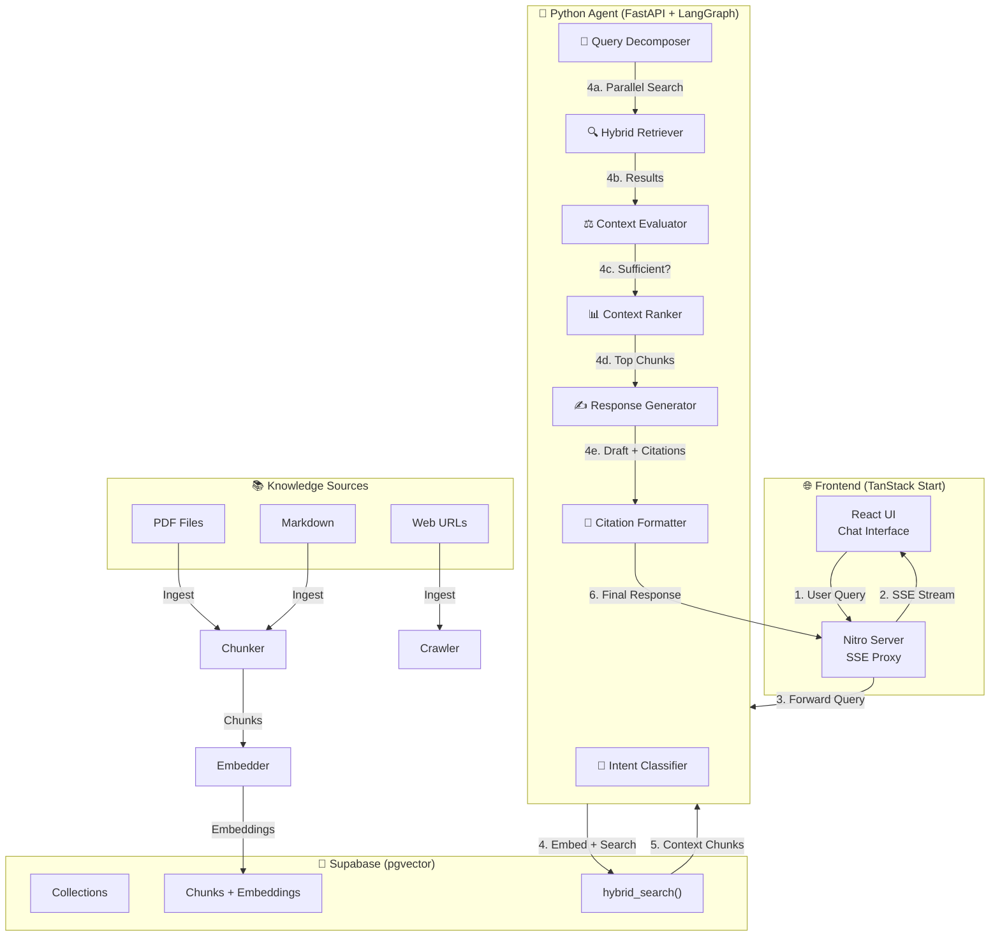
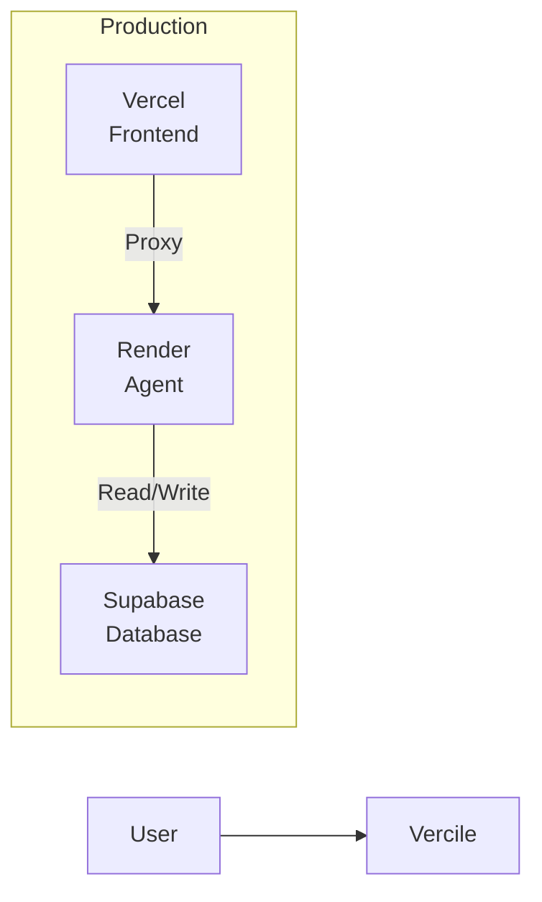

# 🧠 Synapse AI

> An autonomous RAG platform that reasons over your knowledge base with reflective cycles.

Synapse AI is a general-purpose agentic RAG system that connects knowledge sources (PDFs, Markdown, URLs) and answers questions in natural language. Unlike linear RAG, the agent反思—if context is insufficient, it reformulates searches before responding.


## Architecture



## How It Works

### The Agent Loop

1. **Classify** - Determine intent and thinking level (low/medium/high)
2. **Decompose** - Break complex queries into 1-4 sub-queries
3. **Retrieve** - Parallel hybrid search (dense + BM25 + RRF)
4. **Evaluate** - Is context sufficient?
   - **No + iter < 2** → Reformulate → Return to Retrieve
   - **No + iter ≥ 2** → Force continue
   - **Yes** → Continue
5. **Rank** - Deduplicate and select top-8 chunks
6. **Generate** - Create response with `[CITE:chunk_id]` markers
7. **Format** - Validate citations, remove invalid ones

### Tech Stack

| Layer | Technology |
|-------|------------|
| Frontend | TanStack Start + TanStack Query + Tailwind CSS v4 |
| Backend Agent | FastAPI + LangGraph + LangChain |
| LLM | Gemini 3.1 Flash (primary) / DeepSeek V3 via OpenRouter (fallback) |
| Embeddings | Gemini Embedding 001 (1536 dims, MRL) |
| Database | Supabase (pgvector + relational + auth) |
| Ingestion | pypdf, pdfplumber, crawl4ai, tree-sitter |
| Deployment | Vercel (frontend) + Render (agent) |

## Getting Started

### Prerequisites

- Node.js 20+
- Python 3.11+
- pnpm
- Supabase project

### Installation

```bash
# Clone the repo
git clone https://github.com/sergiocvm/synapse-ai.git
cd synapse-ai

# Install dependencies
pnpm install

# Set up environment variables
cp apps/web/.env.local.example apps/web/.env.local
cp apps/agent/.env.example apps/agent/.env

# Run locally
pnpm dev                  # Frontend :3000
cd apps/agent && uvicorn main:app --reload --port 8000
```

### Environment Variables

**Frontend** (`apps/web/.env.local`):
```bash
VITE_SUPABASE_URL=https://xxx.supabase.co
VITE_SUPABASE_ANON_KEY=eyJ...
SUPABASE_SERVICE_ROLE_KEY=eyJ...
AGENT_URL=http://localhost:8000
```

**Agent** (`apps/agent/.env`):
```bash
GEMINI_API_KEY=AIza...
SUPABASE_URL=https://xxx.supabase.co
SUPABASE_SERVICE_ROLE_KEY=eyJ...
OPENROUTER_API_KEY=sk-or-...
```

## Project Structure

```
agentic-rag/
├── apps/
│   ├── web/                    # TanStack Start frontend
│   │   ├── app/
│   │   │   ├── routes/       # File-based routing
│   │   │   ├── components/   # React components
│   │   │   ├── hooks/        # useChat, useIngest
│   │   │   └── server/       # Server functions
│   │   └── vercel.json
│   │
│   └── agent/                  # Python FastAPI agent
│       ├── agent/
│       │   ├── nodes/        # LangGraph nodes
│       │   ├── state.py      # AgentState
│       │   └── graph.py      # StateGraph
│       ├── connectors/        # File + Web connectors
│       ├── ingestion/        # Chunk + Embed pipeline
│       └── main.py           # FastAPI app
│
├── packages/
│   └── types/                 # Shared TypeScript types
│
└── supabase/
    └── migrations/           # DB schema + hybrid_search
```

## Deployment

See [DEPLOY.md](./DEPLOY.md) for detailed deployment instructions.



## License

MIT
