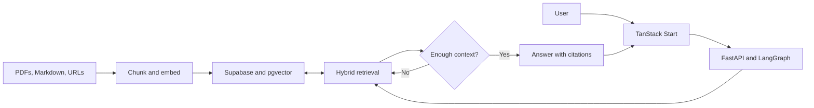

# Synapse AI

> Agentic RAG that evaluates its evidence, retries retrieval when context is weak, and returns cited answers.

[](./LICENSE)


Synapse AI connects PDFs, Markdown files, and web pages to a reflective retrieval pipeline. Complex questions can be decomposed into parallel searches; retrieved context is evaluated before generation, and weak evidence triggers another retrieval pass.

> **Project status:** the Python agent passes static validation. The frontend prototype still needs TanStack Start API/version alignment before its typecheck and production build pass.

## Highlights

- Reflective LangGraph workflow with bounded retrieval retries
- Dense and keyword retrieval combined with reciprocal-rank fusion
- PDF, Markdown, and URL ingestion
- Streaming chat responses with validated source citations
- Supabase authentication, relational storage, and `pgvector`
- TanStack Start frontend and FastAPI agent service

## Architecture


```mermaid
flowchart LR
    Sources["PDFs, Markdown, URLs"] --> Ingestion["Chunk and embed"]
    Ingestion --> Store["Supabase and pgvector"]
    User["User"] --> Web["TanStack Start"]
    Web --> Agent["FastAPI and LangGraph"]
    Agent --> Retrieve["Hybrid retrieval"]
    Retrieve --> Evaluate{"Enough context?"}
    Evaluate -->|No| Retrieve
    Evaluate -->|Yes| Generate["Answer with citations"]
    Generate --> Web
    Store <--> Retrieve
```

## Agent loop

1. Classify the request and choose a reasoning depth.
2. Decompose complex requests into focused sub-queries.
3. Run hybrid retrieval in parallel.
4. Evaluate whether the retrieved evidence is sufficient.
5. Retry with reformulated queries when evidence is weak.
6. Rank and deduplicate the final context.
7. Generate an answer and validate its citations.

## Tech stack

| Layer | Technology |
| --- | --- |
| Web | React, TanStack Start, TanStack Query, Tailwind CSS |
| Agent | Python, FastAPI, LangGraph, LangChain |
| Models | Gemini, with an OpenRouter fallback |
| Retrieval | Dense search, BM25, reciprocal-rank fusion |
| Data | Supabase, PostgreSQL, `pgvector` |
| Deployment | Vercel and Render |

## Run locally

### Prerequisites

- Node.js 20+
- pnpm 8+
- Python 3.11+
- A Supabase project with the migrations in [`supabase/migrations`](./supabase/migrations) applied

### Install

```bash
git clone https://github.com/Sergio-CVM00/synapse-ai.git
cd synapse-ai

pnpm install

python3 -m venv apps/agent/.venv
source apps/agent/.venv/bin/activate
python -m pip install -r apps/agent/requirements.txt

cp apps/web/.env.local.example apps/web/.env.local
cp apps/agent/.env.example apps/agent/.env
```

Fill in the Supabase and model-provider values in the two environment files. Never commit real credentials.

### Start the agent service

```bash
source apps/agent/.venv/bin/activate
cd apps/agent
uvicorn main:app --reload --port 8000
```

## Verify

```bash
python -m compileall apps/agent
```

## Project structure

```text
apps/web/            TanStack Start application
apps/agent/          FastAPI and LangGraph agent
packages/types/      Shared TypeScript contracts
supabase/migrations/ Database schema and hybrid search
```

Deployment notes are available in [`DEPLOY.md`](./DEPLOY.md).

## License

[MIT](./LICENSE)
